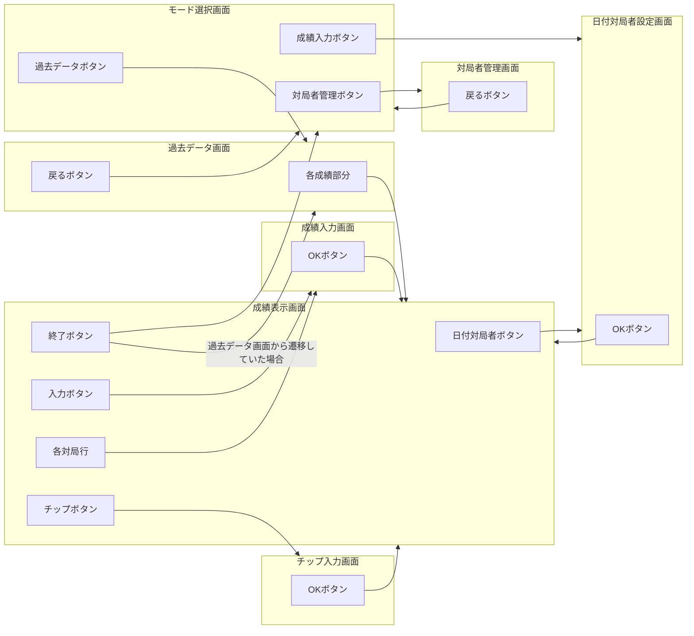

### 画面遷移図（全体）

```mermaid
flowchart LR
	subgraph 01-top[モード選択画面]
        A[対局者管理ボタン]
        B[過去データボタン]
        C[成績入力ボタン]
    end
	
	subgraph 02-kanri[対局者管理画面]
        D[戻るボタン]
    end
    
    subgraph 03-Data[過去データ画面]
        E[各成績部分]
        F[戻るボタン]
    end
    
    subgraph 04-set[日付対局者設定画面]
        G[OKボタン]
    end
    
    subgraph 05-view[成績表示画面]
        H[日付対局者ボタン]
        i[入力ボタン]
        J[各対局行]
        K[チップボタン]
        L[終了ボタン]
    end
    
    subgraph 06-input[成績入力画面]
        M[OKボタン]
    end
    
    subgraph 07-chip[チップ入力画面]
        N[OKボタン]
    end
    
    A --> 02-kanri
    B --> 03-Data
    C --> 04-set
    D --> 01-top
    E --> 05-view
    F --> 01-top
    G --> 05-view
    H --> 04-set
    L --> 01-top
	L -- 過去データ画面から遷移していた場合 --> 03-Data
    i --> 06-input
    J --> 06-input
    M --> 05-view
    K --> 07-chip
    N --> 05-view
```
