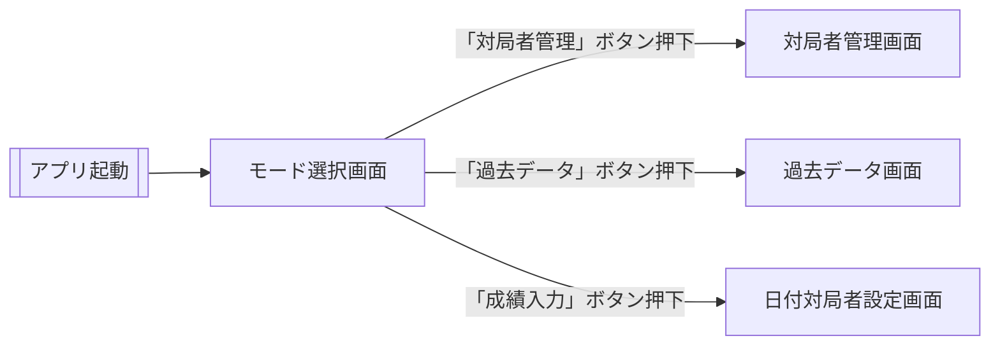
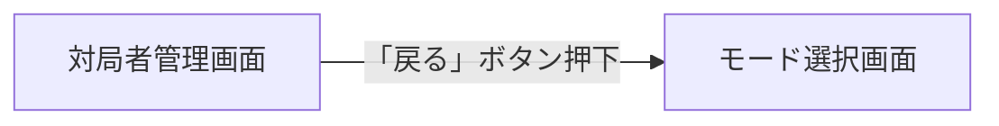
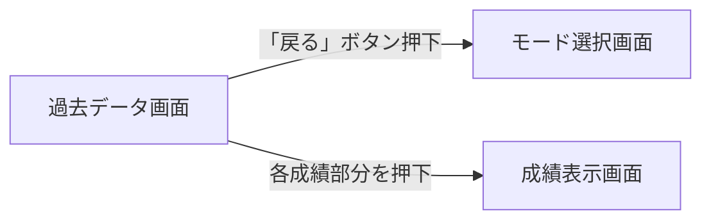
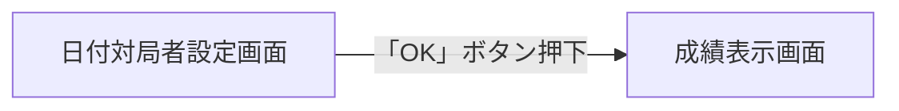
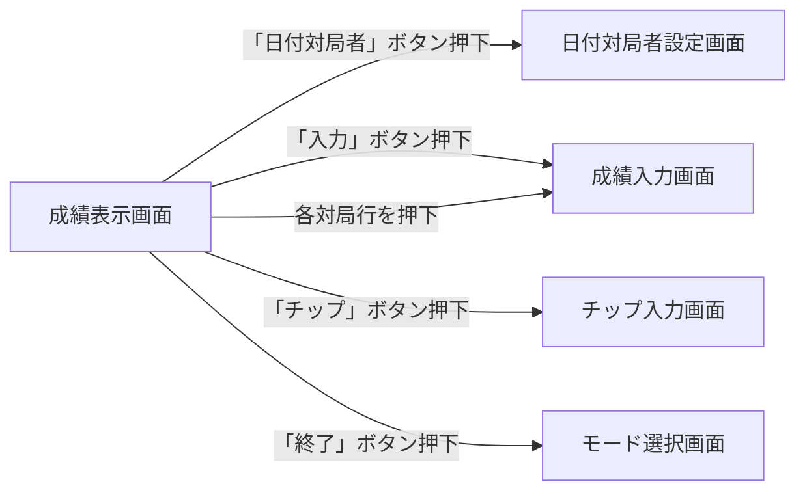
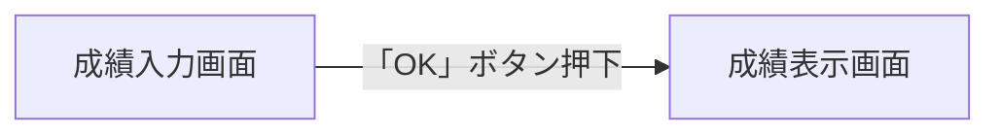
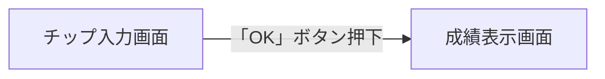

# 画面遷移図
### モード選択画面（01-top）

```mermaid
flowchart LR
	start[[アプリ起動]] --> 01-top[モード選択画面（01-top）]
    01-top[モード選択画面] -- 「対局者管理」ボタン押下 --> 02-kanri[対局者管理画面]
    01-top[モード選択画面] -- 「過去データ」ボタン押下 --> 03-Data[過去データ画面]
    01-top[モード選択画面] -- 「成績入力」ボタン押下 --> 04-set[日付対局者設定画面]
```

### 対局者管理画面（02-kanri）

```mermaid
flowchart LR
	02-kanri[対局者管理画面] -- 「戻る」ボタン押下 --> 01-top[モード選択画面]
```

### 過去データ画面（03-Data）

```mermaid
flowchart LR
	03-Data[過去データ画面] -- 「戻る」ボタン押下 --> 01-top[モード選択画面]
	03-Data[過去データ画面] -- 各成績部分を押下 --> 05-view[成績表示画面]
```

### 日付対局者設定画面（04-set）

```mermaid
flowchart LR
	04-set[日付対局者設定画面] -- 「OK」ボタン押下 --> 05-view[成績表示画面]
```

### 成績表示画面（05-view）

```mermaid
flowchart LR
	05-view[成績表示画面] -- 「日付対局者」ボタン押下 --> 04-set[日付対局者設定画面]
	05-view[成績表示画面] -- 「入力」ボタン押下 --> 06-input[成績入力画面]
	05-view[成績表示画面] -- 各対局行を押下 --> 06-input[成績入力画面]
	05-view[成績表示画面] -- 「チップ」ボタン押下 --> 07-chip[チップ入力画面]
	05-view[成績表示画面] -- 「終了」ボタン押下 --> 01-top[モード選択画面]
```

### 成績入力画面（06-input）

```mermaid
flowchart LR
	06-input[成績入力画面] -- 「OK」ボタン押下 --> 05-view[成績表示画面]
```

### チップ入力画面（07-chip）

```mermaid
flowchart LR
	07-chip[チップ入力画面] -- 「OK」ボタン押下 --> 05-view[成績表示画面]
```
