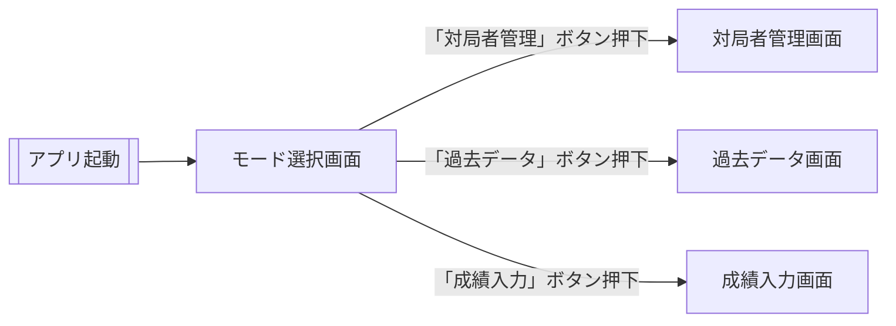
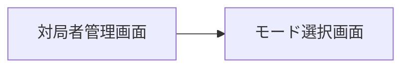

# 画面遷移図
### モード選択画面

```mermaid
flowchart LR
	start[[アプリ起動]] --> 01-top[モード選択画面]
    01-top[モード選択画面] -- 「対局者管理」ボタン押下 --> 02-kanri[対局者管理画面]
    01-top[モード選択画面] -- 「過去データ」ボタン押下 --> 03-Data[過去データ画面]
    01-top[モード選択画面] -- 「成績入力」ボタン押下 --> 04-input[成績入力画面]
```

### 対局者管理画面

```mermaid
flowchart LR
	02-kanri[対局者管理画面] --> 01-top[モード選択画面]
```
