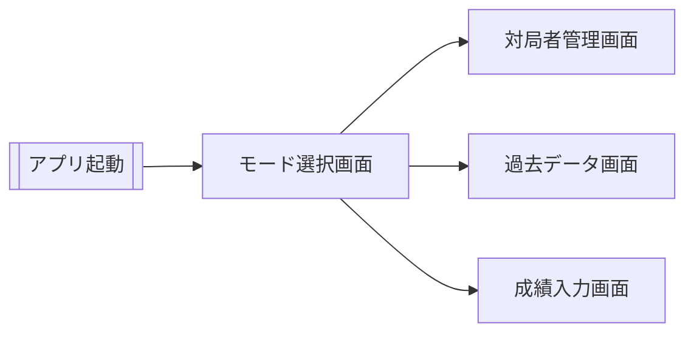

# 画面遷移図
### モード選択画面

```mermaid
flowchart LR
	start[[アプリ起動]] --> 01-top[モード選択画面]
    01-top[モード選択画面] --> 02-kanri[対局者管理画面]
    01-top[モード選択画面] --> 03-Data[過去データ画面]
    01-top[モード選択画面] --> 04-input[成績入力画面]
```
