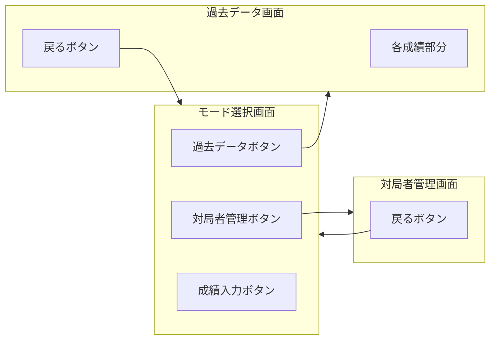

### 画面遷移図（全体）

```mermaid
flowchart LR
	subgraph 01-top[モード選択画面]
        A[対局者管理ボタン]
        B[過去データボタン]
        C[成績入力ボタン]
    end
	
	subgraph 02-kanri[対局者管理画面]
        D[戻るボタン]
    end
    
    subgraph 03-Data[過去データ画面]
        E[各成績部分]
        F[戻るボタン]
    end
    
    A --> 02-kanri
    B --> 03-Data
    D --> 01-top
    F --> 01-top
```
